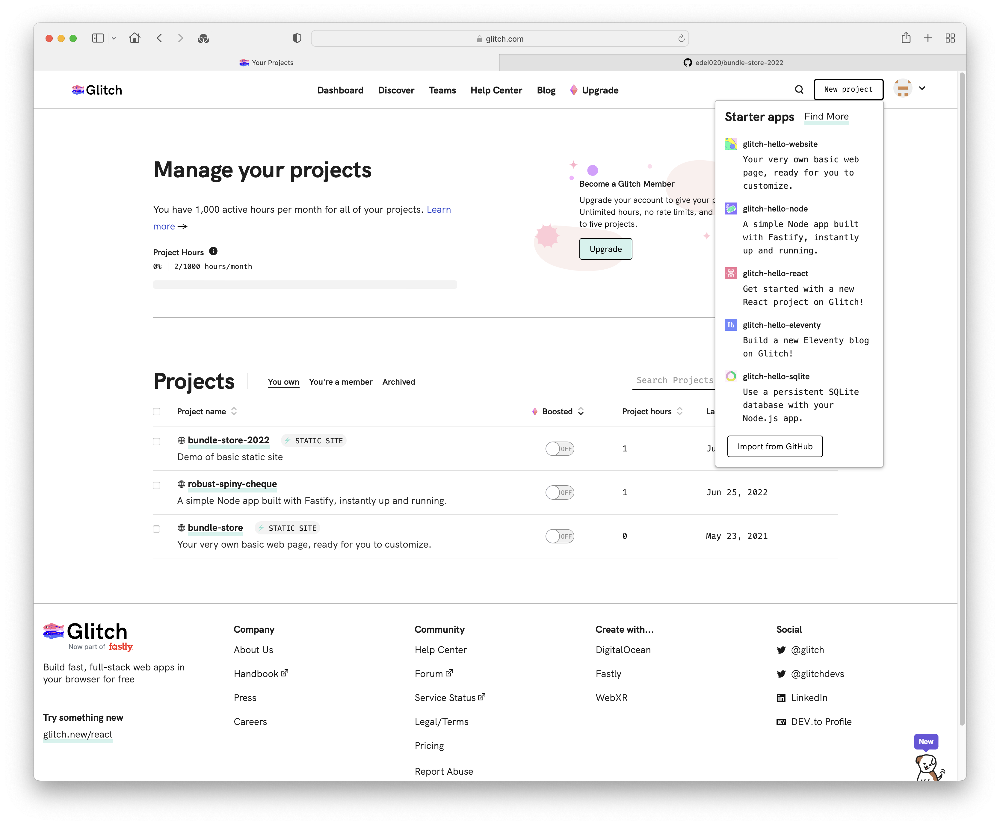
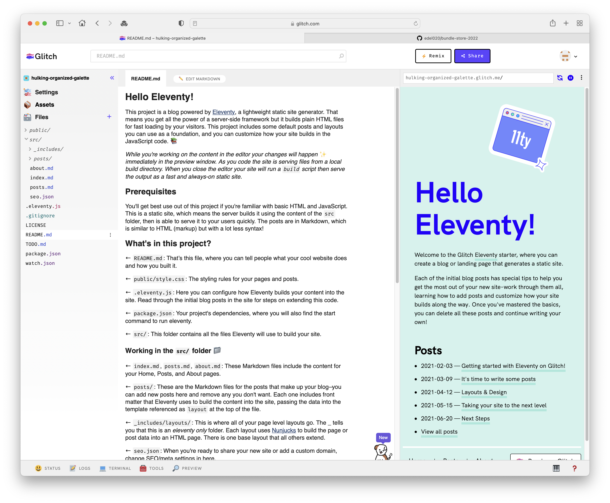

# Exercises

Explore the other project types:

In general, the projects require more background knowledge on the frameworks these projects use. The focus of this course will be on the `Node` category - which most closely matches our work to date on the Play Java framework. 

However, you may also be interested in the Eleventy project:

We explored this type of project briefly already. The above configuration is using Markdown as the notation to author web site content.

