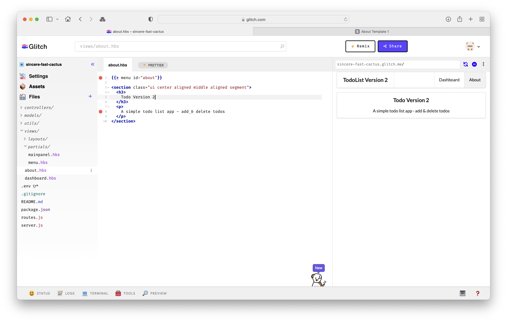

# Branding Update

We can change the title of the app :

## views/about.hbs

```html
{{> menu id="about"}}

<section class="ui center aligned middle aligned segment">
  <h3>
    Todo Version 2
  </h3>
  <p>
    A simple todo list app - add & delete todos
  </p>
</section>
```

## views/partials/menu.hbs

```html
<nav class="ui menu">
  <header class="ui header item">TodoList Version 2</header>
  <div class="right menu">
    <a id="dashboard" class="item" href="/dashboard"> Dashboard </a>
    <a id="about" class="item" href="/about"> About </a>
  </div>
</nav>

<script>
  $("#{{id}}").addClass("active item");
</script>
```

Make sure the changes are reflected in the running app.

NOTE: A bug in glitch may mean that it flags some handlebars specific syntax in your partials:



Refresh the page to clear this error. The running app will show the updates, even if the error is not cleared.
