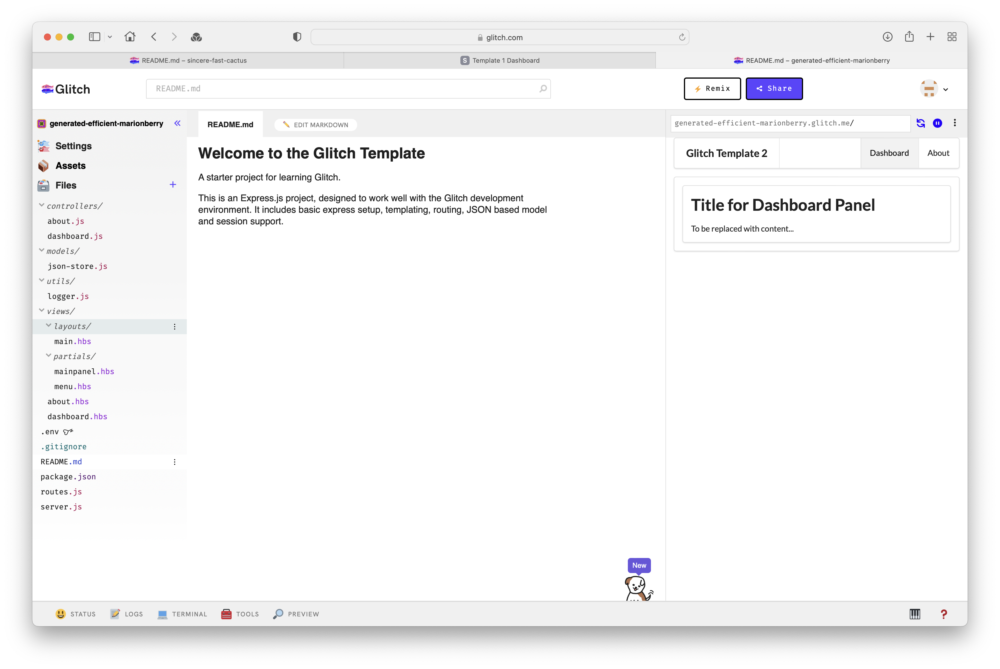

# Template 1

Create a new project in Glitch - selecting `Import from Github`:

In the subsequent dialog, enter this repo url:

~~~bash
https://github.com/wit-hdip-comp-sci-2021/glitch-template
~~~

Press ok to import the project.

### View Logs

Now, select `Logs` (a button along the end of the screen), and turn on logs:

Now press the `Preview ->In a new Window` button

This should reveal the application running:

Explore the (small) number of views.
