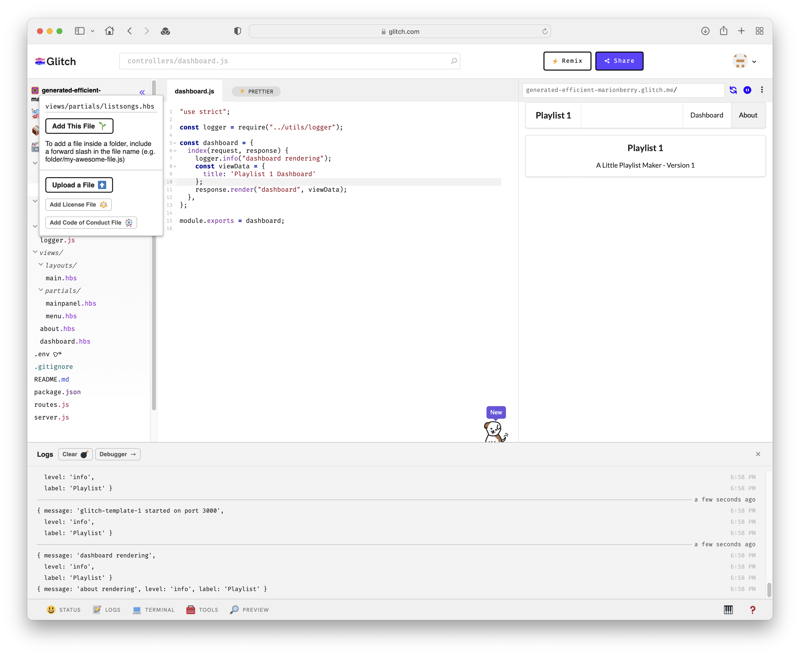
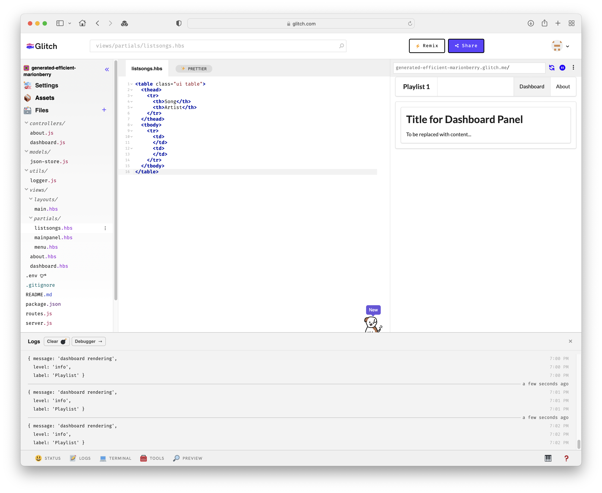
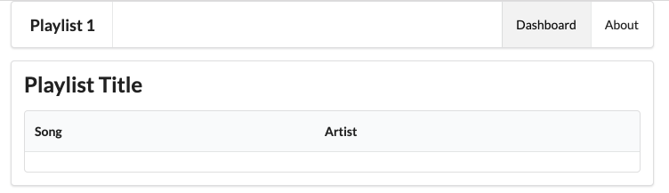
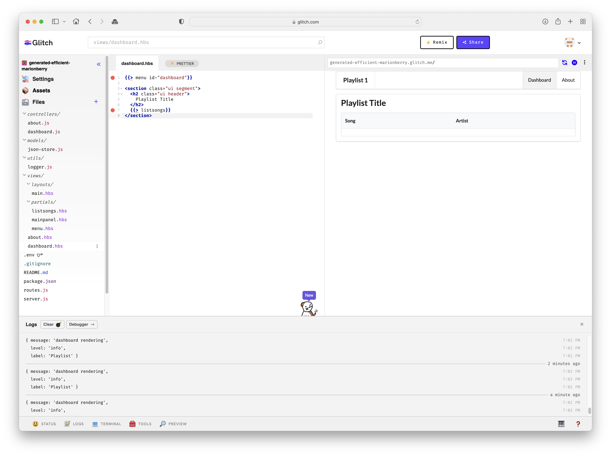
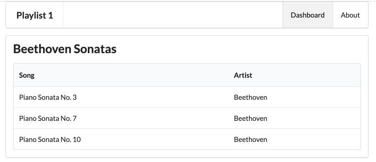
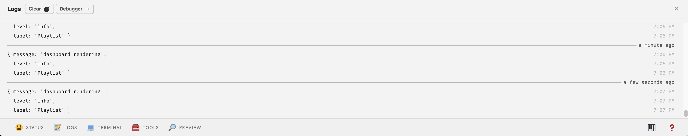

# Static Playlist

In this step we will start to display the playlist itself. First, create a new partial called `listsongs.hbs`:

## views/partials/listsongs.hbs

~~~html
<table class="ui table">
  <thead>
    <tr>
      <th>Song</th>
      <th>Artist</th>
    </tr>
  </thead>
  <tbody>
    <tr>
      <td>
      </td>
      <td>
      </td>
    </tr>
  </tbody>
</table>
~~~

Files can be added by selecting the folder and pressing 'Add File to Folder' from a context menu:

Then press 'Add File to Folder' - and enter the name of the file `listsongs.hbs`

The file can be edited now - paste the listsongs.hbs template source in  now.

Replace the contents of dashboard.hbs with the following:

## views/dashboard.hbs

~~~html
{{> menu id="dashboard"}}

<section class="ui segment">
  <h2 class="ui header">
    Playlist Title
  </h2>
  {{> listsongs}}
</section>
~~~

Make sure the app runs successfully - the dashboard should look like this:

Note: You may see an error like this when you paste in the above version of dashboard.hbs:

The errors above are due to a bug in Glitch - and can be cleared by refreshing the browser.

To test out the UX, we might include some actual songs (replace the tbody with the following):

## views/partials/listsongs.hbs

~~~html
<tbody>
  <tr>
    <td>
      Piano Sonata No. 3
    </td>
    <td>
      Beethoven
    </td>
  </tr>
  <tr>
    <td>
      Piano Sonata No. 7
    </td>
    <td>
      Beethoven
    </td>
  </tr>
  <tr>
    <td>
      Piano Sonata No. 10
    </td>
    <td>
      Beethoven
    </td>
  </tr>
</tbody>
~~~

... and also give the playlist a title:

## views/dashboard.hbs

~~~html
....
  <h2 class="ui header">
    Beethoven Sonatas
  </h2>
...
~~~

The dashboard should look like this:

Exercise the UX fully again. Keep an eye on the logs

Locate where in the controllers these messages are being generated:

~~~js
...
    logger.info('start rendering');
...
~~~

These logging messages are a useful technique for figuring out what might be going wrong with an app. There are three variants of the logging statement: `info`, `error` and `debug`. Experiment now with some of these, and exercise the app to make sure the log messages appear.

~~~js
...
    logger.error('some error has occurred');
...
~~~

~~~js
...
    logger.debug('some step has occurred...');
...
~~~

Error and debug messages may appear in red. You might need to open the `source` and `run` views of the app in side by side windows to get a clearer view of the logs.
